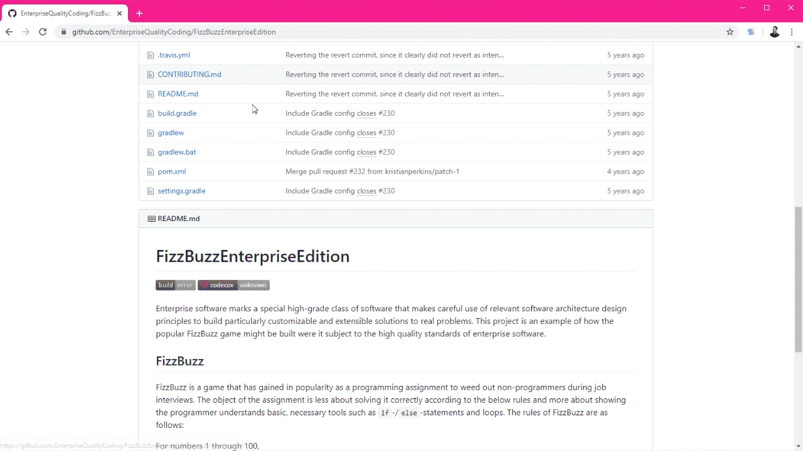

# Slinky - Bookmark with hotkeys and hashtags.

### **About Slinky**

The idea behind Slinky is to create a bookmarking system that utilizes hotkeys and hashtags. 
This means you can save and manage links without rifling through folders.

### **Features**

React.js tab view with a custom webpack (no create-react-app) 
Firebase with anonymous auth
Vanilla JavaScript
Google chrome extension tools

### **How does it work?**

To save a bookmark
- Install the chrome extension
- Press ctr + b or cmd + b to bring up the slinky extension
- Enter each tag you would like to add to the page (you can also edit the title of the site here too)
- Press enter when complete

To view bookmarks
- Press ctr + v or cmd + v to bring up all your saved addresses
- Use the search bar to filter through your bookmarks
- Press tab until your bookmark is selected and press enter to open it.

